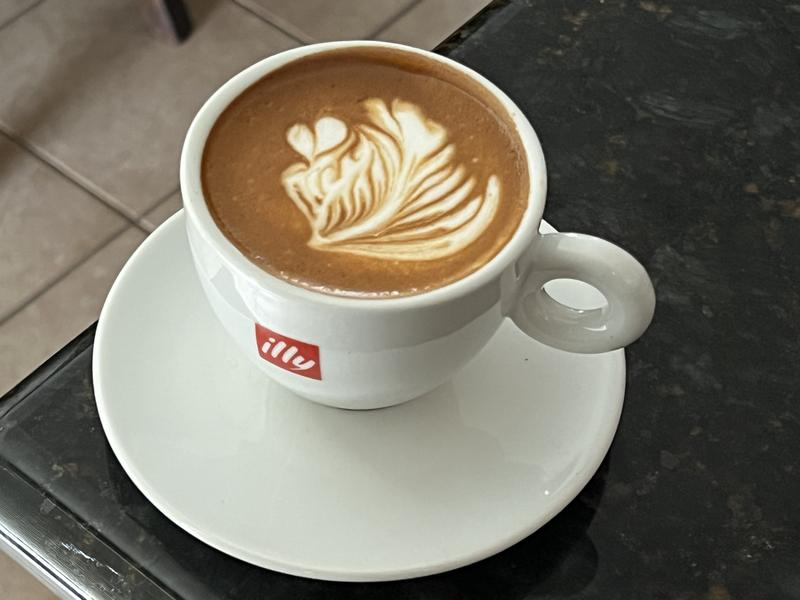

# Cozy Cup Cafe

## Project Description

CozyCafe emerged from a passionate endeavor by two close friends, Nick Brienne Martinez and John Aivanne Molato, who shared a profound love for the artistry and science behind coffee brewing. Their friendship began during their college years, where they bonded over their shared interests and aspirations. Drawing inspiration from their experiences and fueled by their mutual admiration for Italian coffee culture, they embarked on a journey to bring the authentic flavors of Italian coffee craftsmanship to their community in the heart of downtown Seattle.

### Features

**Home**
- showcase the features of our web applications

**Menu**
- showcase the different kind of coffee and pastries that we have in our cafe store

**About Us**
- showcasing the history, origins, and values.

**Contact**
- displaying the contact information.

##### Screen Captures

### Image 1

Description: Indulge in the classic Italian favorite - a harmonious trio of espresso, steamed milk, and airy foam. 

### Image 2

Description: A harmonious blend of smooth espresso and creamy steamed milk, topped with a delicate layer of froth.

### Image 3

Description: Indulge in a British classic – our freshly baked scones are delightfully tender and crumbly. 

### Image 4

Description: Treat yourself to moist and flavorful goodness with our freshly baked muffins.

## About the Authors

**Name:** John Aivanne Molato

**Email:** Molatojohnaivanneofficial@gmail.com

